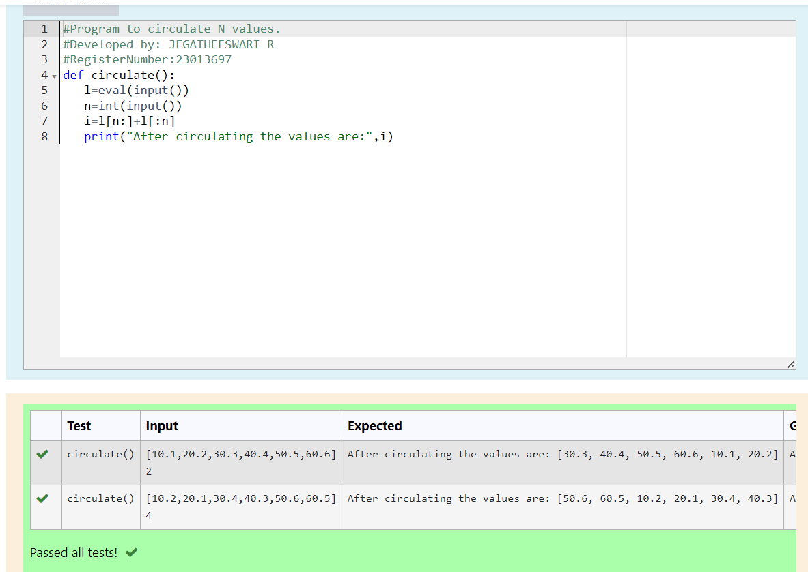

# Circulate-the-values-of-N-variables
## Aim:
To write a python program to circulate the n variables using function concept
## Equipment’s required:
PC
Anaconda - Python 3.7
## Algorithm:
### Step 1: 
Get the values from the user
### Step 2: 
Get the output
### Step 3: 
Get the value from the user for the number of rotation
### Step 4: 
Using the slicing concept rotate the list

### Step 5: 
Print the values it would be interchanged
### Step 6: 
End the program
## Program:
<<<<<<< HEAD
# Program to circulate N values.
```
Developed by: JEGATHEESWARI R
RegisterNumber:23013697
=======

# Program to circulate N values.
# Developed by: JEGATHEESWARI R
# RegisterNumber:23013697
```
>>>>>>> 64f5bbc4d14e4f8375b2eb25496addc095e3f9b8
def circulate():
   l=eval(input())
   n=int(input())
   i=l[n:]+l[:n]
   print("After circulating the values are:",i)
```
## Output:

<<<<<<< HEAD
## Result:
Completed successfully.
=======


## Result:
Successfully completed.
>>>>>>> 64f5bbc4d14e4f8375b2eb25496addc095e3f9b8
